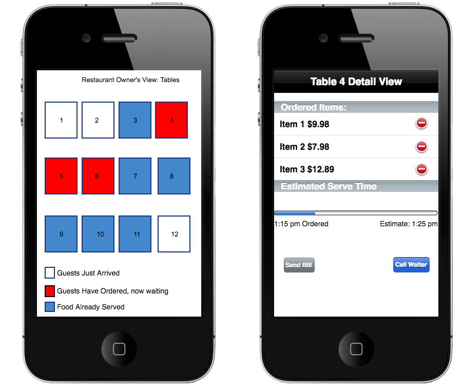
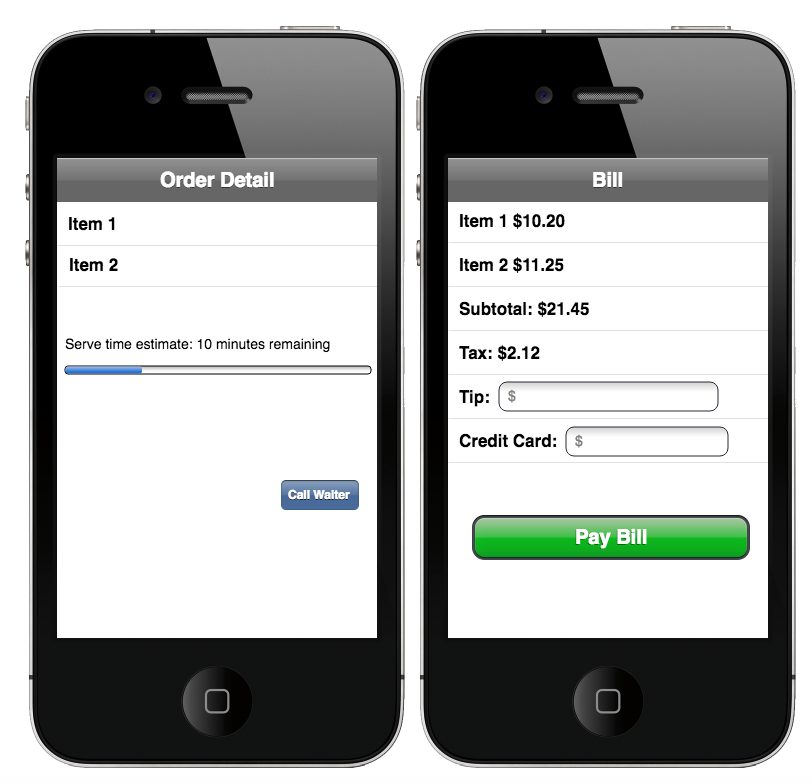
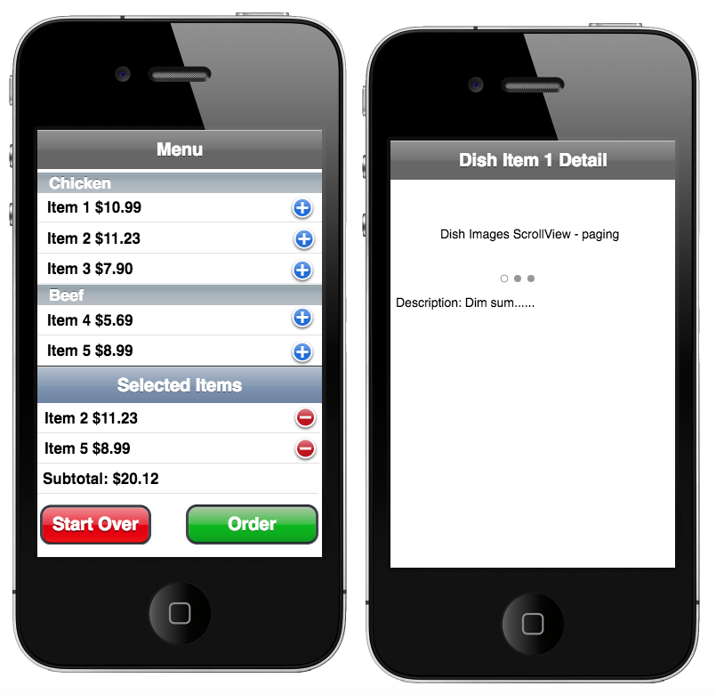

*Wait-Less*

Wait-less gives diners a more intimate experience by allowing them to spend more time with their loved ones, and less time waiting for food.  Restaurant users can set up the layout of their restaurant in the app and see which orders are pending.  Diners who download the app can view the menu, place orders in the app and view their bill.

## User Stories

The following user stories are **required**:

- [ ] Restaurant layout
- [ ] Detail view of each table
- [ ] Clients can view the menu and place orders
- [ ] Clients can see their receipt
- [ ] Clients can summon the waiter or the manager
- [ ] Clients can see the live status of their order placed
- [ ] Clients can pay for their order

The following user stories are  **optional**

- [ ] Popular orders today
- [ ] Alerts for upcoming events at the restaurant
- [ ] Lunch, Dinner specials

## Wireframes:
1. Restaurant Owner's View:

2. Restaurant Customer's View:

## Video Walkthrough

Here's a walkthrough of implemented user stories:

**Recorded for the May 8th, 2017 Report:**

GIF created with [LiceCap](http://www.cockos.com/licecap/).

## Notes

Describe any challenges encountered while building the app.

## License

    Copyright [2017] [name of copyright owner]

    Licensed under the Apache License, Version 2.0 (the "License");
    you may not use this file except in compliance with the License.
    You may obtain a copy of the License at

        http://www.apache.org/licenses/LICENSE-2.0

    Unless required by applicable law or agreed to in writing, software
    distributed under the License is distributed on an "AS IS" BASIS,
    WITHOUT WARRANTIES OR CONDITIONS OF ANY KIND, either express or implied.
    See the License for the specific language governing permissions and
    limitations under the License.
